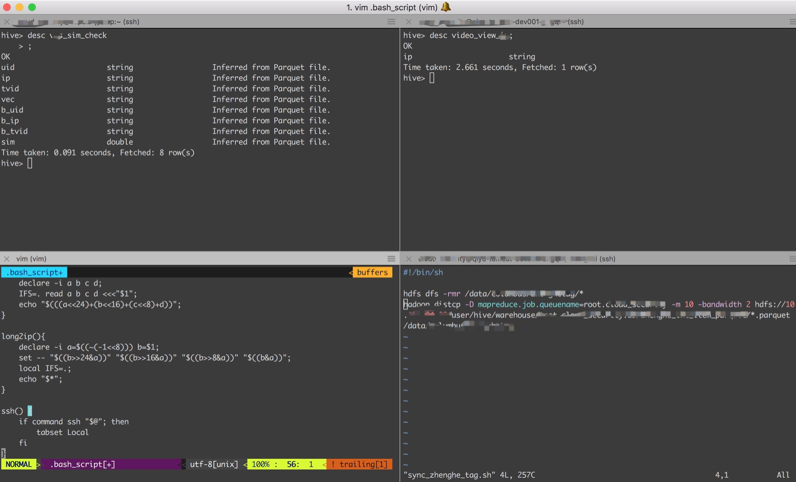

# effective-macbook
A list of effective ways to use a Macbook

## Manage your apps

* [Homebrew](https://brew.sh/)
* [Homebrew cask](https://caskroom.github.io/)

```
/usr/bin/ruby -e "$(curl -fsSL https://raw.githubusercontent.com/Homebrew/install/master/install)"
brew tap caskroom/cask
```

## Use a more friendly command line

* [Iterm2](https://www.iterm2.com/downloads.html)
* [Iterm2 themes](https://github.com/mbadolato/iTerm2-Color-Schemes)

## Install neccessary command line tools

* [oh-my-zsh](https://github.com/robbyrussell/oh-my-zsh)
* [GNU coreutils](https://github.com/coreutils/coreutils)
* [git](https://git-scm.com)
* [openssl](https://openssl.org/)
* [tree](http://mama.indstate.edu/users/ice/tree/)
* [autojump](https://github.com/wting/autojump)
* [dos2unix](https://waterlan.home.xs4all.nl/dos2unix.html)
* [parquet-tools](https://parquet.apache.org/)
* [libcouchbase](https://developer.couchbase.com/documentation/server/4.5/sdk/c/start-using-sdk.html)
* [proxychains-ng](https://sourceforge.net/projects/proxychains-ng/)
* [jenv](http://www.jenv.be)
* [httpie](https://httpie.org/)
* [unrar](https://www.rarlab.com/)
* [the silver searcher](https://github.com/ggreer/the_silver_searcher)
* [tabset](https://github.com/jonathaneunice/iterm2-tab-set)
* [nmap](https://nmap.org/)

```
sh -c "$(curl -fsSL https://raw.githubusercontent.com/robbyrussell/oh-my-zsh/master/tools/install.sh)"
brew install coreutils git openssl tree autojump dos2unix parquet-tools \
  libcouchbase proxychains-ng jenv httpie unrar tabset the_silver_searcher \
  nmap
```

## Prevent running commands on an incorrent machine



## Use aliases when you can

```
alias ..='cd ..'
alias ...='cd ../../'
alias _='cd -'

alias gitp='git pull --rebase'
alias gitst='git status'
alias gitcl='git clone'
alias git1diff='git diff HEAD~1 HEAD'
alias gitcmt='git commit'
alias gitpo='git push origin'

alias sha1='openssl sha1'
alias sha256='openssl sha1 -a 256'
```

[Full verison](https://github.com/WalterInSH/dotfile/blob/master/MACOSX/bash_aliases)

## Handy script functions

```
mkdircd () {
    mkdir -p "$@" && eval cd "\"\$$#\"";
}

ip2long(){
    declare -i a b c d;
    IFS=. read a b c d <<<"$1";
    echo "$(((a<<24)+(b<<16)+(c<<8)+d))";
}
```

[Full version](https://github.com/WalterInSH/dotfile/blob/master/MACOSX/bash_script)

## Command line tips

### Copy text from command line

```
alias pbc='pbcopy'

#eg. copy current path
pwd|pbc
```

### Edit copied text from command line

```
alias pbp='pbpaste'

#eg. convert copied text to uppercase
pbp|sed "s/./\U&/g"

#eg. use pbc with pbp
pbp|sed "s/./\U&/g"|pbc
```

## Nice HTTP API development tools

* [postman](https://www.getpostman.com/)

## Track web requests

* [charles](https://www.charlesproxy.com/)

## Shadowsocks

* [ShadowsocksX-NG](https://github.com/shadowsocks/ShadowsocksX-NG/releases/)

## Nice file preview tools

* [quicklook-json](http://www.sagtau.com/quicklookjson.html)
* [quicklook-csv](https://github.com/p2/quicklook-csv)

```
brew cask install quicklook-json quicklook-csv
```

## Powerful mind mapping tools

* [xmind](http://www.xmind.net/)

## Screen capture tools

* [截图Jietu](https://itunes.apple.com/cn/app/%E6%88%AA%E5%9B%BE-jietu-%E5%BF%AB%E9%80%9F%E6%A0%87%E6%B3%A8-%E4%BE%BF%E6%8D%B7%E5%88%86%E4%BA%AB%E7%9A%84%E6%88%AA%E5%B1%8F%E5%B7%A5%E5%85%B7/id1059334054?mt=12)
* [LICEcap](https://www.cockos.com/licecap/)

## Make a presentation with markdown

* [marp](https://github.com/yhatt/marp)

## Try something quickly 

* [docker](https://www.docker.com/community-edition#/mac)
